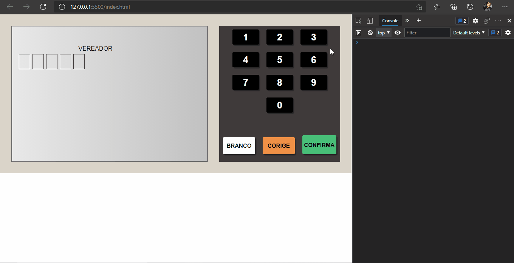

<h1>Projeto Unra Eletronica</h1>

Exercício urna eletronica completamente customizável.

<h6>Apresenta alguns erros os quais serão consertado nos dias posteriores.<h6>

<h2>Erros</h2>

O texto quando diz que o voto é em branco não aparece tampouco as informações do candidado, quando digitado o número do mesmo 

<h1>Segue o GIF demonstrando</h1>
 
